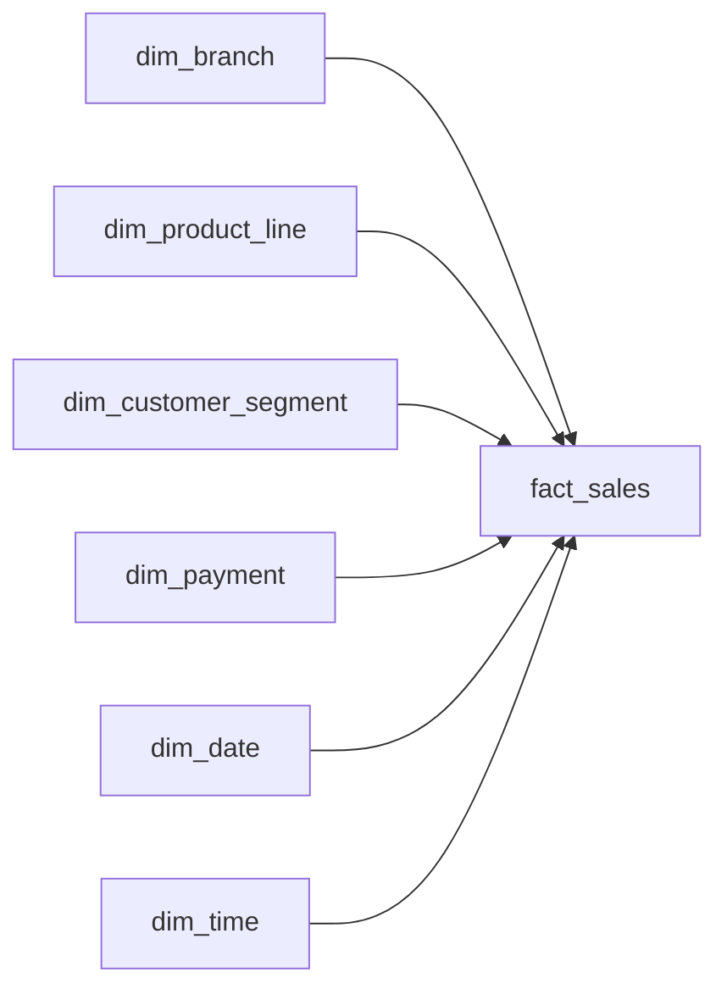

# Supermarket Sales Data Warehouse

I built this project using a public supermarket sales dataset with 1,000 transactions from three branches.

I started by loading the data into PostgreSQL, then separated it into raw, staging, and warehouse layers. From there, I built a star schema, added data quality checks, created reporting views, and wrote SQL queries to analyze the sales data.

After building the warehouse manually, I added Python scripts so the full load can now run from one command.

## Project workflow

The project follows this flow:

```text
CSV file
→ raw layer
→ staging layer
→ dimension tables
→ fact table
→ data quality checks
→ reporting and analysis
```

The raw layer keeps the source data close to how it arrived.

The staging layer cleans the data and converts the columns into the right data types.

The warehouse layer organizes the data into fact and dimension tables so it is easier to query and report on.

## Automated pipeline

The first version of the project was loaded manually. I later added Python scripts to automate the same process.

The automated flow is:

```text
CSV
→ raw.supermarket_sales
→ staging.supermarket_sales_clean
→ dimensions
→ fact_sales
→ data quality checks
```

The full pipeline runs with:

```bash
python python/run_pipeline.py
```

At the end of the run, it checks that the row counts and main business totals still match.

A successful run currently gives:

```text
Rows reconciled: 1000
Revenue reconciled: 322966.7490
Quantity reconciled: 5510
Gross income reconciled: 15379.3690
Missing dimension keys: 0
```
### Incremental loading

The pipeline also supports incremental loads.

Incoming sales files are checked against existing invoice IDs so that only new transactions move through the pipeline. The same file can be processed more than once without creating duplicate records.

I tested the pipeline with two batches:

- initial load: 990 transactions
- second load: 10 new transactions
- second file rerun: 0 additional transactions

After the final run, the warehouse remained at 1,000 unique invoices and all data quality checks passed.

## Warehouse tables

The warehouse has one fact table and six dimension tables.

### Dimensions

- `dim_branch` — branch and city
- `dim_product_line` — product category
- `dim_customer_segment` — customer type and gender
- `dim_payment` — payment method
- `dim_date` — date attributes
- `dim_time` — time and time-of-day attributes

### Fact table

`fact_sales` stores one row per invoice transaction.

It contains the dimension keys along with measures such as:

- quantity
- unit price
- tax
- total
- COGS
- gross income
- rating

The grain of `fact_sales` is **one row per invoice transaction**.

## Star schema



## Technical highlights

- Built raw, staging, and warehouse schemas in PostgreSQL
- Designed a star schema with six dimensions and one fact table
- Used surrogate keys and foreign keys to connect the warehouse tables
- Profiled and checked the source data before loading the warehouse
- Compared staging and warehouse totals after the load
- Created reusable reporting views
- Used joins, CTEs, window functions, aggregations, and ranking functions
- Added indexes to the fact table
- Used `ANALYZE` and `EXPLAIN ANALYZE` to look at query performance
- Added Python scripts to automate the warehouse load

## Data quality checks

Before building the warehouse, I checked for:

- missing invoice IDs
- duplicate invoices
- invalid quantities
- invalid prices and totals
- ratings outside the expected range
- inconsistent branch and city combinations
- incorrect COGS, tax, total, and gross income calculations

After loading the warehouse, I compared the staging table with `fact_sales`.

The final checks matched:

- 1,000 staging rows
- 1,000 fact rows
- total revenue: 322,966.7490
- total quantity: 5,510
- gross income: 15,379.3690
- no missing foreign keys

These checks now also run automatically at the end of the Python pipeline.

## A few things I found

Some of the SQL analysis showed that:

- Branch C in Naypyitaw had the highest total revenue
- Food and beverages had the highest overall product-line revenue
- Afternoon was the busiest time of day
- The highest-revenue product category was different for each branch
- Ewallet had the most transactions, while Cash generated the most revenue
- January had the highest monthly revenue
- Member/Female was the highest-revenue customer segment

These results were queried from the warehouse rather than directly from the CSV.

## Reporting views

I created a few views to make common queries easier:

- `vw_sales_detail`
- `vw_branch_performance`
- `vw_monthly_performance`

## Tools used

- PostgreSQL
- Python
- SQL
- DBeaver
- VS Code
- Git
- GitHub

## Project structure

```text
supermarket-sales-warehouse/
├── data/
│   └── README.md
├── python/
│   ├── load_raw.py
│   ├── load_staging.py
│   ├── load_warehouse.py
│   ├── quality_checks.py
│   └── run_pipeline.py
├── sql/
│   └── numbered SQL scripts for setup, loading, validation, reporting, analysis, and performance
├── docs/
│   ├── data_dictionary.md
│   └── star_schema.md
├── .env.example
├── requirements.txt
└── README.md
```

## How to run the project

Create a PostgreSQL database called:

```text
supermarket_dw
```

Run the SQL setup files to create the schemas and tables.

The source dataset is not included in the repository. See `data/README.md` for the dataset information.

Create a virtual environment:

```bash
python3 -m venv .venv
source .venv/bin/activate
```

Install the required packages:

```bash
pip install -r requirements.txt
```

Create a local `.env` file using `.env.example` as a guide.

Then run:

```bash
python python/run_pipeline.py
```

This loads the raw data, builds the staging and warehouse tables, and runs the final quality checks.

## Dataset

This project uses a public supermarket sales dataset with 1,000 transactions from three branches.

I renamed the source column headers to `snake_case` before loading the file into PostgreSQL.

The dataset itself is not included in this repository.

## Documentation

- [Data dictionary](docs/data_dictionary.md)
- [Star schema](docs/star_schema.md)