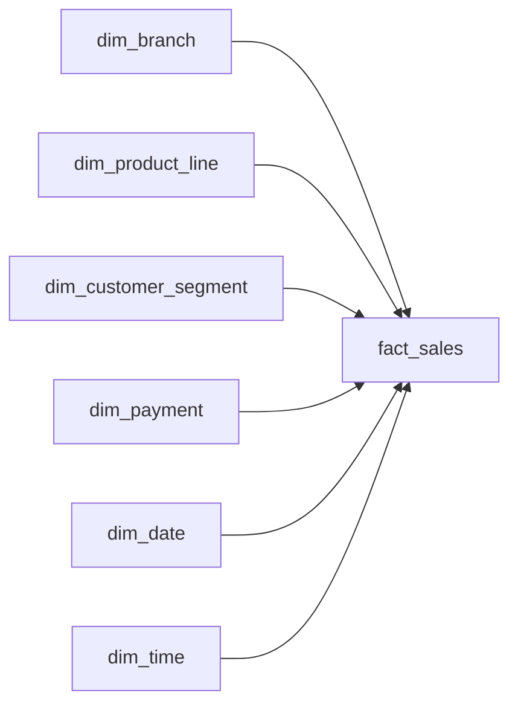

# Supermarket Sales Data Warehouse

This is a hands-on data engineering project built with a public supermarket sales dataset.

I used PostgreSQL and DBeaver to build a small data warehouse from the ground up. The goal was to practice the full workflow: loading raw data, checking data quality, cleaning and transforming it, building fact and dimension tables, validating the warehouse, and writing reporting queries.

The dataset contains 1,000 sales transactions from three supermarket branches.

## Project workflow

The project follows this flow:

CSV file  
→ raw layer  
→ staging layer  
→ dimension tables  
→ fact table  
→ data quality checks  
→ reporting views  
→ analysis

The raw layer keeps the source data as close to the original file as possible.

The staging layer cleans the data and converts columns into the right data types.

The warehouse layer contains the fact and dimension tables used for reporting and analysis.

## Warehouse tables

The warehouse is built around one sales fact table and six dimension tables.

### Dimensions

- `dim_branch` — branch and city information
- `dim_product_line` — product category information
- `dim_customer_segment` — customer type and gender
- `dim_payment` — payment methods
- `dim_date` — calendar attributes for each sale date
- `dim_time` — transaction time and time-of-day category

### Fact table

- `fact_sales` — stores one row per invoice transaction, along with the measures used for reporting such as quantity, total, COGS, gross income, and rating

The grain of `fact_sales` is one row per invoice transaction.


## Star schema


## Technical highlights

- Built a PostgreSQL data warehouse using raw, staging, and warehouse schemas
- Designed a star schema with six dimensions and a sales fact table
- Loaded dimension tables using surrogate keys and connected them to `fact_sales`
- Added data quality and source-to-warehouse reconciliation checks
- Created reporting views for sales, branch, and monthly performance
- Used joins, CTEs, window functions, and aggregations for analysis
- Added indexes on fact-table foreign keys
- Used `ANALYZE` and `EXPLAIN ANALYZE` to review query performance


## Data quality checks

Before loading the warehouse, I checked the data for:

- missing invoice IDs
- duplicate invoices
- invalid quantities
- invalid prices
- invalid totals
- ratings outside the expected range
- inconsistent branch and city combinations
- incorrect COGS, tax, total, and gross income calculations

After loading the warehouse, I compared the staging and fact tables to make sure the data was not lost or duplicated.

The final checks matched:

- 1,000 staging rows
- 1,000 fact rows
- total revenue: 322,966.7490
- total quantity: 5,510
- gross income: 15,379.3690
- no missing foreign keys

## A few things I found

Some of the analysis showed that:

- Branch C in Naypyitaw had the highest total revenue
- Food and beverages was the highest-revenue product line overall
- Afternoon was the busiest time of day across all three branches
- The top product category was different for each branch
- Ewallet had the highest transaction count, while Cash generated the highest revenue
- January had the highest monthly revenue, followed by March and then February

These results came from SQL queries built on top of the fact and dimension tables rather than directly from the raw CSV.

## Tools used

- PostgreSQL
- DBeaver
- SQL
- VS Code

PostgreSQL was used to build and store the warehouse, DBeaver was used to work with the database, and VS Code was used to organize the SQL scripts and project files.

## Project structure

```text
supermarket-sales-warehouse/
├── data/
│   └── README.md
├── sql/
│   └── numbered SQL scripts for setup, loading, validation, reporting, and performance
├── docs/
│   ├── data_dictionary.md
│   └── star_schema.md
└── README.md
```
## How to run the project

1. Create a PostgreSQL database called `supermarket_dw`.
2. Run the SQL files in the `sql` folder in number order.
3. Load `data/supermarket_sales_clean.csv` into `raw.supermarket_sales`.
4. Run the staging and warehouse load scripts.
5. Run `09_quality_checks.sql` to confirm the warehouse totals match.
6. Use the reporting views or queries in `12_analysis.sql` to explore the data.


## Dataset

This project uses a public supermarket sales dataset with 1,000 transactions from three branches.

The data includes branch, city, customer type, gender, product line, unit price, quantity, tax, total, date, time, payment method, COGS, gross income, and rating.

The dataset is used only for learning and portfolio purposes.