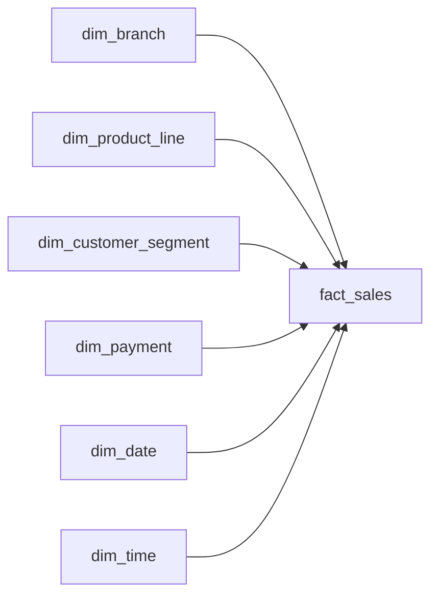

# Supermarket Sales Data Warehouse

A PostgreSQL data warehouse built from a public supermarket sales dataset with 1,000 transactions across three branches.

The project covers the full flow from raw ingestion to reporting, with incremental loading, automated data quality checks, and Airflow orchestration.

## Architecture

```text
Incoming CSV
→ Raw
→ Staging
→ Dimensions
→ Fact table
→ Data quality checks
→ Reporting
```

Airflow manages the workflow, detects incoming files, runs the pipeline, and moves successfully processed files to a processed folder.

## What it does

* Loads sales data into PostgreSQL
* Separates raw, staging, and warehouse layers
* Uses incremental loading based on `invoice_id`
* Prevents duplicate transactions when files are reprocessed
* Builds a star schema with one fact table and six dimensions
* Runs source-to-warehouse reconciliation checks
* Creates reusable reporting views
* Uses Airflow for scheduling, retries, file sensing, task dependencies, and logging
* Archives processed files after a successful run

## Data model

### Fact table

`fact_sales`

Grain: **one row per invoice transaction**

### Dimensions

* `dim_branch`
* `dim_product_line`
* `dim_customer_segment`
* `dim_payment`
* `dim_date`
* `dim_time`

## Star schema



## Data quality

The pipeline checks:

* row-count reconciliation
* duplicate invoices
* revenue reconciliation
* quantity reconciliation
* gross income reconciliation
* missing dimension keys

Final validated totals:

* 1,000 fact rows
* 1,000 unique invoices
* revenue: 322,966.7490
* quantity: 5,510
* gross income: 15,379.3690
* missing dimension keys: 0

## Incremental loading

Incoming files are checked against existing invoice IDs so only new transactions are added.

The pipeline was tested with:

* initial load: 990 transactions
* second load: 10 new transactions
* second file rerun: 0 additional transactions

This keeps the pipeline idempotent and prevents duplicate sales records when the same file is processed again.

## Airflow orchestration

The Airflow DAG runs the pipeline in this order:

```text
wait_for_sales_file
→ load_raw
→ load_staging
→ load_warehouse
→ quality_checks
→ archive_file
```

The DAG runs daily, includes two retries per task, and keeps task-level logs for troubleshooting.

## Reporting views

The warehouse includes reusable views for common reporting needs:

* `vw_sales_detail`
* `vw_branch_performance`
* `vw_monthly_performance`

SQL reporting queries are also included for branch, product, customer, payment, and time-based analysis.

## Tech stack

* PostgreSQL
* Python
* SQL
* Apache Airflow
* DBeaver
* VS Code
* Git
* GitHub

## Project structure

```text
supermarket-sales-warehouse/
├── airflow/
│   └── dags/
│       └── supermarket_pipeline_dag.py
├── data/
│   └── README.md
├── python/
├── sql/
├── docs/
│   ├── data_dictionary.md
│   └── star_schema.md
├── .env.example
├── requirements.txt
└── README.md
```

## Run locally

Create a PostgreSQL database called:

```text
supermarket_dw
```

Install the Python dependencies:

```bash
pip install -r requirements.txt
```

Create a local `.env` file based on `.env.example`, then run the pipeline with:

```bash
python python/run_pipeline.py <csv_file>
```

The Airflow DAG is located at:

```text
airflow/dags/supermarket_pipeline_dag.py
```

## Dataset

This project uses a public supermarket sales dataset containing 1,000 transactions from three branches.

The source column headers were renamed to `snake_case` before loading the data into PostgreSQL.

The dataset itself is not included in this repository.

## Documentation

* [Data dictionary](docs/data_dictionary.md)
* [Star schema](docs/star_schema.md)
