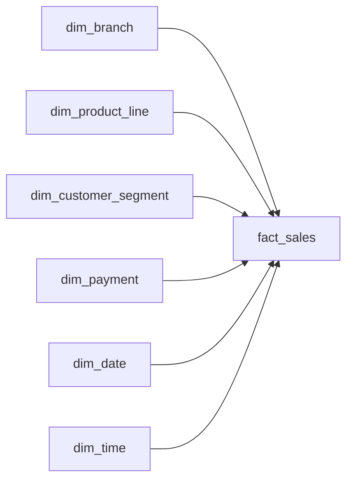

# Supermarket Sales Data Engineering Pipeline

An end-to-end data engineering project that ingests supermarket sales files from Amazon S3, loads new records incrementally into PostgreSQL, transforms the data with dbt, validates data quality, and orchestrates the workflow with Apache Airflow.

The source dataset contains 1,000 supermarket sales transactions across three branches.

## Architecture

```text
Amazon S3
incoming/
    ↓
Airflow sensor
    ↓
Download CSV with Boto3
    ↓
Python incremental ingestion
    ↓
PostgreSQL
raw.supermarket_sales
    ↓
dbt staging
stg_supermarket_sales
    ↓
dbt dimensions
    ├── dim_branch
    ├── dim_product_line
    ├── dim_customer_segment
    ├── dim_payment
    ├── dim_date
    └── dim_time
    ↓
incremental fact_sales
    ↓
dbt data quality tests
    ↓
Airflow archive task
    ↓
Amazon S3
processed/
```

## Tech Stack

- Python
- PostgreSQL
- SQL
- dbt Core
- Apache Airflow
- Amazon S3
- Boto3
- DBeaver
- Git
- GitHub

## How the Pipeline Works

The project separates ingestion, transformation, testing, and orchestration between different tools.

### Python

Python handles ingestion and S3 operations.

It:

- checks the S3 `incoming/` folder for CSV files
- downloads incoming files
- loads only new invoice records into PostgreSQL
- prevents duplicate raw records using `invoice_id`
- archives successfully processed files to S3 `processed/`

### dbt

dbt handles warehouse transformations and data quality.

It:

- cleans and types raw source data
- builds six dimension models
- builds the central `fact_sales` model
- incrementally processes new invoices
- validates primary and foreign-key integrity
- runs business-rule tests
- performs source-to-fact reconciliation
- generates documentation and lineage
- demonstrates historical change tracking with a dbt snapshot

### Apache Airflow

Airflow orchestrates the complete workflow.

The DAG contains five tasks:

```text
wait_for_s3_file
        ↓
download_file
        ↓
load_raw
        ↓
dbt_build
        ↓
archive_file
```

The DAG runs daily and includes:

- S3 file sensing
- retries
- task dependencies
- task-level logging
- soft handling when no new file is available
- `max_active_runs=1` to prevent concurrent runs from processing the same S3 file

The `dbt_build` task runs dbt from a separate dbt virtual environment:

```bash
dbt build --select +fact_sales
```

A file is archived only after ingestion, transformation, and dbt testing succeed.

## Data Model

The warehouse uses a star schema.

### Fact Table

`dbt_dev.fact_sales`

Grain:

**One row per invoice transaction**

The model is materialized incrementally using `invoice_id` as the unique key.

### Dimension Tables

- `dbt_dev.dim_branch`
- `dbt_dev.dim_product_line`
- `dbt_dev.dim_customer_segment`
- `dbt_dev.dim_payment`
- `dbt_dev.dim_date`
- `dbt_dev.dim_time`

## Star Schema



## Incremental Raw Loading

Incoming transactions are checked against existing `invoice_id` values in:

```text
raw.supermarket_sales
```

Only new invoices are inserted.

The ingestion process was tested using:

```text
Initial batch:     990 rows
New batch:          10 rows
Reprocessed file:    0 new rows
```

This makes the ingestion process idempotent and prevents duplicate transactions when a file is processed more than once.

## Incremental dbt Model

`fact_sales` is configured as a dbt incremental model.

The incremental behavior was tested in two situations.

### No new data

After the initial 1,000 rows were built, a normal incremental run returned:

```text
INSERT 0 0
```

No duplicate fact rows were created.

### New data

Two temporary invoices were added to the raw layer.

The next dbt incremental run returned:

```text
INSERT 0 2
```

The fact table increased from:

```text
1000 rows
```

to:

```text
1002 rows
1002 unique invoices
```

The temporary test records were removed afterward and the project was restored to its original 1,000-row dataset.

## Data Quality

The dbt project contains **52 data tests**.

### Structural Tests

The project uses dbt tests including:

- `not_null`
- `unique`
- `relationships`
- `accepted_values`

### Referential Integrity

Every foreign key in `fact_sales` is tested against its corresponding dimension.

```text
fact_sales.branch_key
→ dim_branch.branch_key

fact_sales.product_line_key
→ dim_product_line.product_line_key

fact_sales.customer_segment_key
→ dim_customer_segment.customer_segment_key

fact_sales.payment_key
→ dim_payment.payment_key

fact_sales.date_key
→ dim_date.date_key

fact_sales.time_key
→ dim_time.time_key
```

### Business-Rule Tests

Custom dbt tests validate that:

- quantity is positive
- unit price is positive
- total is not negative
- gross income is not negative
- rating is between 0 and 10

### Reconciliation Tests

Custom tests also verify:

- raw row count = staging row count = fact row count
- staging revenue = fact revenue
- staging quantity = fact quantity
- staging gross income = fact gross income

The full dbt test suite passes successfully:

```text
PASS=52
WARN=0
ERROR=0
```

## Final Validated Results

The final clean warehouse contains:

```text
Fact rows:        1,000
Unique invoices:  1,000
Revenue:          322,966.7490
Quantity:         5,510
Gross income:     15,379.3690
```

## dbt Documentation and Lineage

dbt documentation can be generated with:

```bash
dbt docs generate
dbt docs serve
```

The lineage graph shows the transformation path:

```text
raw.supermarket_sales
        ↓
stg_supermarket_sales
        ↓
six dimensions
        ↓
fact_sales
        ↓
data tests
```

Dependencies are created through dbt `source()` and `ref()` calls.

## dbt Snapshot / Slowly Changing Dimension

The project includes:

```text
dbt/snapshots/dim_branch_snapshot.sql
```

The snapshot demonstrates Slowly Changing Dimension Type 2 behavior.

It uses:

```text
branch
```

as the stable business key and tracks changes to:

```text
city
```

A temporary branch-city change was used to demonstrate how dbt preserves an old version and creates a new current version instead of overwriting history.

The demonstration data was removed afterward and the snapshot was reset to a clean baseline.

## Amazon S3 Workflow

New files are placed under:

```text
incoming/
```

After a successful pipeline run, Airflow archives the file under:

```text
processed/
```

Example:

```text
incoming/new_sales.csv
        ↓
pipeline succeeds
        ↓
processed/new_sales.csv
```

AWS credentials are not embedded in the source code. Boto3 uses the local AWS credential chain.

## Concurrency Protection

The DAG uses:

```python
max_active_runs=1
```

This prevents two DAG runs from processing the same incoming S3 object at the same time.

This was added after testing concurrent manual and scheduled runs that attempted to work with the same file.

## Project Structure

```text
supermarket-sales-warehouse/
│
├── airflow/
│   └── dags/
│       └── supermarket_pipeline_dag.py
│
├── dbt/
│   ├── models/
│   │   ├── staging/
│   │   └── marts/
│   ├── snapshots/
│   ├── tests/
│   └── dbt_project.yml
│
├── python/
│   ├── archive_s3_file.py
│   ├── create_test_batches.py
│   ├── download_from_s3.py
│   ├── list_s3_files.py
│   └── load_raw_incremental.py
│
├── sql/
│   ├── 01_setup.sql
│   ├── 02_raw_table.sql
│   └── 12_analysis.sql
│
├── docs/
│   ├── data_dictionary.md
│   └── star_schema.md
│
├── data/
│   └── README.md
│
├── .env.example
├── .gitignore
├── requirements.txt
└── README.md
```

## Local Setup

### 1. PostgreSQL

Create a PostgreSQL database named:

```text
supermarket_dw
```

Run:

```text
sql/01_setup.sql
sql/02_raw_table.sql
```

to create the raw schema and landing table.

### 2. Environment Variables

Create a local `.env` file based on `.env.example`.

Example:

```text
DB_HOST=localhost
DB_PORT=5432
DB_NAME=supermarket_dw
DB_USER=your_postgres_username
DB_PASSWORD=your_postgres_password
```

Do not commit `.env` or AWS credentials.

### 3. Python Dependencies

Install the ingestion dependencies:

```bash
pip install -r requirements.txt
```

### 4. dbt

The dbt project is located in:

```text
dbt/
```

Configure a local PostgreSQL dbt profile and verify the connection:

```bash
cd dbt
dbt debug
```

Build and test the project:

```bash
dbt build
```

### 5. Airflow

The DAG is located at:

```text
airflow/dags/supermarket_pipeline_dag.py
```

The local project uses a separate Airflow virtual environment.

Set `AIRFLOW_HOME` to the project's `airflow` directory before starting Airflow.

Example:

```bash
export AIRFLOW_HOME="/path/to/supermarket-sales-warehouse/airflow"
```

## Dataset

This project uses a public supermarket sales dataset containing:

- 1,000 transactions
- 3 branches
- 6 product lines
- sales from January through March 2019

The source column names were converted to `snake_case` before ingestion.

The dataset itself is not committed to this repository.

## Documentation

- [Data Dictionary](docs/data_dictionary.md)
- [Star Schema](docs/star_schema.md)