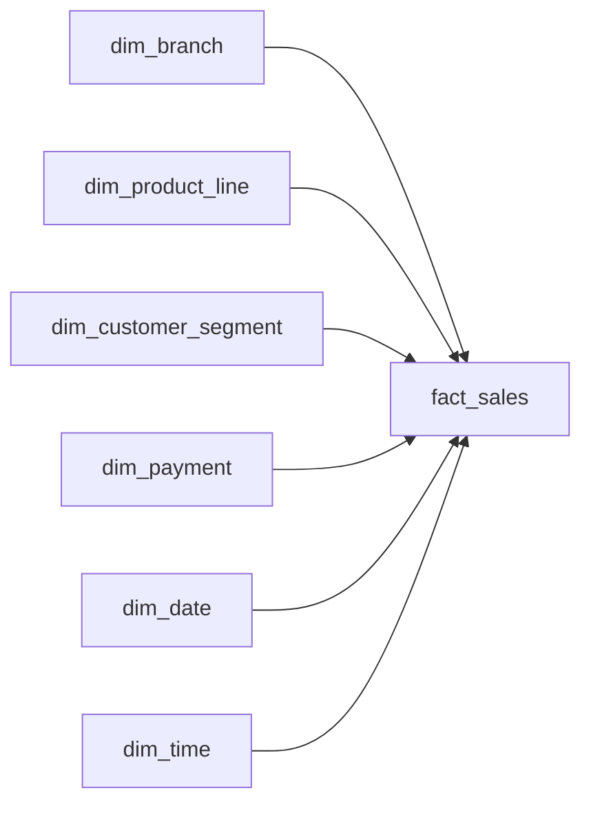

# Star Schema

The warehouse uses a dimensional star schema with `fact_sales` as the central fact table.

The grain of `fact_sales` is:

**One row per invoice transaction**

The fact table connects to six dimension tables:

- `dim_branch`
- `dim_product_line`
- `dim_customer_segment`
- `dim_payment`
- `dim_date`
- `dim_time`

## Star Schema Diagram



## Dimension Relationships

Each foreign key in `fact_sales` connects to the matching key in a dimension table.

```text
fact_sales.branch_key
→ dim_branch.branch_key

fact_sales.product_line_key
→ dim_product_line.product_line_key

fact_sales.customer_segment_key
→ dim_customer_segment.customer_segment_key

fact_sales.payment_key
→ dim_payment.payment_key

fact_sales.date_key
→ dim_date.date_key

fact_sales.time_key
→ dim_time.time_key
```

These relationships allow the fact table to store transaction measures while the dimension tables store descriptive information.

For example:

```text
fact_sales.branch_key = 1
        ↓
dim_branch.branch_key = 1
        ↓
Branch A, Yangon
```

dbt relationship tests validate all six foreign-key relationships.

## Fact Table

`fact_sales` contains the transaction-level measures used for analysis.

Examples include:

- unit price
- quantity
- tax
- total
- cost of goods sold
- gross income
- rating

The grain is one row per invoice transaction.

## Dimension Tables

### dim_branch

Stores the branch and city associated with each transaction.

### dim_product_line

Stores the product-line category.

### dim_customer_segment

Stores customer segments based on customer type and gender.

### dim_payment

Stores the payment method used for the transaction.

### dim_date

Stores calendar attributes for the sale date.

### dim_time

Stores time attributes for the transaction time.

## Transformation Lineage

The star schema describes how the final warehouse tables relate to each other.

dbt lineage shows how the data moves through the transformation process.

```text
raw.supermarket_sales
        ↓
stg_supermarket_sales
        ↓
 ┌─────────────────────────────┐
 │ dim_branch                  │
 │ dim_product_line            │
 │ dim_customer_segment        │
 │ dim_payment                 │
 │ dim_date                    │
 │ dim_time                    │
 └──────────────┬──────────────┘
                ↓
            fact_sales
                ↓
            dbt tests
```

The dependency graph is created automatically by dbt through `source()` and `ref()` calls.

## Data Quality

The star schema is validated with dbt tests.

The project checks:

- dimension keys are not null
- dimension keys are unique
- fact foreign keys are not null
- fact foreign keys exist in their corresponding dimensions
- invoice IDs are unique
- business rules are valid
- source and fact totals reconcile

## Documentation

- [Data Dictionary](data_dictionary.md)
- [Project README](../README.md)